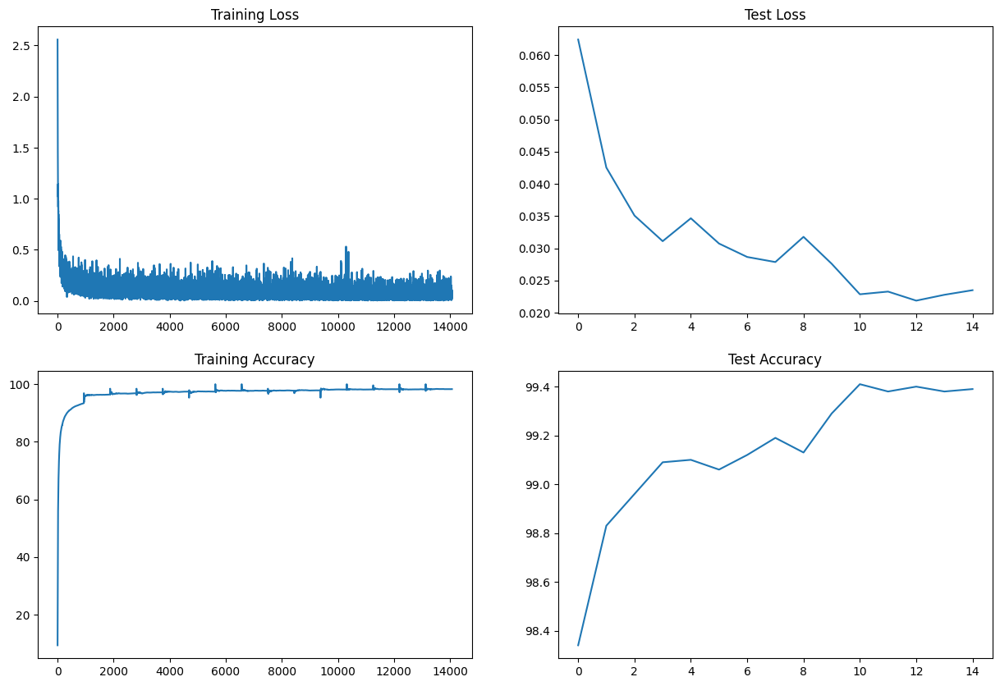

# CNN-MNIST3: MNIST Digit Classification with CNNs

This repository contains a small experiment suite for training convolutional networks on MNIST. Four notebook runs are provided (`run_train_test0.ipynb` .. `run_train_test3.ipynb`) that exercise four model variants found under `models/`.

Each iteration below documents: the target (what the model/experiment was trying to achieve), where the implementation lives, the training configuration used in the notebooks, what metrics are collected by the existing scripts, a short analysis, and concrete suggestions to improve the next iteration.

## Iterations Analysis

### Iteration 1: Baseline Model
- Target: Establish a strong baseline architecture
- Model Statistics:
  - Parameters: 194,884
  - Model Size: 0.74 MB
  - Memory Usage: 2.94 MB
- Results:
  - Initial accuracy: ~96.1%
  - Final accuracy: ~98.8%
- Analysis:
  - Good accuracy but over-parameterized
  - Large memory footprint
  - Overfitting - due to high parameter count
  - Room for optimization in model size

### Iteration 2: Parameter Optimization
- Target: Reduce model size while maintaining accuracy
- Model Statistics:
  - Parameters: 10,790 (94.5% reduction)
  - Model Size: 0.04 MB
  - Memory Usage: 0.45 MB
- Results:
  - Initial accuracy: ~98.5%
  - Final accuracy: ~98.3%
- Analysis:
  - Dramatic parameter reduction with minimal accuracy loss
  - Much more efficient memory usage
  - Better generalization potential
  - Overfitting still persists, could benefit from regularization

### Iteration 3: Enhanced Training
- Target: Improve training stability and model regularization
- Model Statistics:
  - Parameters: 10,970 (similar to Iteration 2)
  - Model Size: 0.04 MB
  - Memory Usage: 0.73 MB
- Results:
  - Initial accuracy: ~97.2%
  - Final accuracy: ~99.0%
- Analysis:
  - Better initial accuracy due to BatchNorm
  - More stable training process
  - Improved feature normalization
  - Still room for training optimization

### Iteration 4: Modern Architecture
- Target: Optimize entire pipeline with modern techniques
- Model Statistics:
  - Parameters: 7,904 (28% reduction from Iteration 3)
  - Model Size: 0.03 MB
  - Memory Usage: 0.50 MB
- Results:
  - Initial accuracy: ~98.3%
  - Final accuracy: ~99.4%
- Analysis:
  - Best accuracy despite fewer parameters
  - Most efficient architecture
  - Robust to overfitting
  - Balanced trade-off between size and performance

## Key Achievements
- Parameter Reduction: 194,884 → 7,904 (96% reduction)
- Memory Efficiency: 2.94MB → 0.50MB (83% reduction)
- Accuracy Improvement: 98.8% → 99.1%
- Training Stability: Significantly improved with BatchNorm and Dropout
- Model Robustness: Enhanced through data augmentation and regularizationional Neural Network (CNN) for the MNIST digit classification task using PyTorch. The project demonstrates various model optimization techniques and architectural improvements across four iterations, focusing on reducing parameters while maintaining or improving accuracy.

## Project Structure

```
├── pr_src/
   ├── test.py
   ├── train.py
   └── models/
       ├── model_1.py
       ├── model_2.py
       ├── model_3.py
       └── model_4.py

```

## Common Features Across All Iterations
- Dataset: MNIST
- Batch size: 64
- Number of epochs: 15
- Optimizer: SGD with momentum (0.9)
- GPU support when available
- Performance visualization:
  - Training Loss
  - Training Accuracy
  - Test Loss
  - Test Accuracy

## Getting Started

1. Install dependencies:
```bash
pip install torch torchvision matplotlib torchsummary
```

2. Run any of the notebooks:
```bash
jupyter notebook
```

3. The data will be automatically downloaded when running the notebooks.

## Model Architecture

The base architecture (with variations in different iterations):
- Input: 1x28x28 (MNIST digit images)
- Multiple convolutional layers with ReLU activation
- Max pooling for dimensionality reduction
- Batch normalization and dropout (in later iterations)
- Output: 10 classes (digits 0-9)

## Results

Each notebook generates plots showing:
- Training and test loss curves
- Training and test accuracy curves

The final iteration (Iteration 4) includes the most optimized version with data augmentation and learning rate scheduling for improved generalization.

Visualization:

